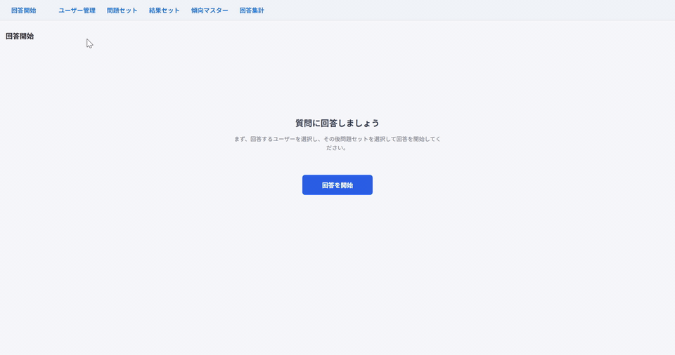
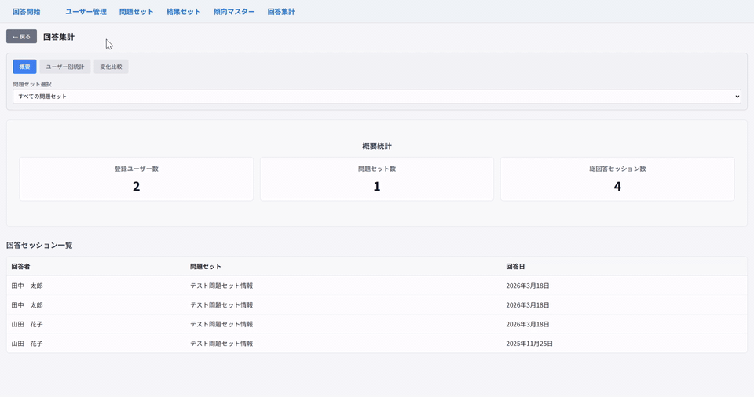

# chihiro

`chihiro` は、MCT（Metacognitive Training / メタ認知トレーニング）を支援するための試作アプリです。  
作業療法士による利用を主な想定とし、回答実施、結果表示、比較、集計、長期的な傾向把握をローカル環境で扱えるようにすることを目指しています。

Tauri + React + TypeScript で構成されており、データは SQLite に保存されます。

## デモ

### 回答フロー


### 集計・管理画面


## ダウンロード

- Windows 版: [v1.0.0 リリース](https://github.com/Ogawara-Seiji/chihiro-publish/releases/tag/v1.0.0)

現時点では Windows 版を試作・配布しています。  
macOS / Linux 版は今後対応予定です。

## 想定している利用シーン

- MCT を実施する作業療法士向けの支援
- 利用者ごとの回答履歴のローカル管理
- 回答結果の比較や変化の把握
- 次回の介入や関わり方を考える材料の整理

## このアプリでできること

- 回答開始から、ユーザー選択、問題選択、回答、結果表示までの一連フロー
- ユーザー管理
- 問題セット管理
- 結果セット管理
- 傾向マスター管理
- 回答内容の集計と比較
- 回答履歴をもとにした長期的な変化の確認
- ローカル SQLite を使ったデータ保存

## 設計方針

- オフラインで動作できることを重視
- 作業療法士の現場で扱いやすい軽量な構成を優先
- 将来的に PC だけでなくタブレット等の複数デバイスへ展開しやすい構成を意識
- 限られた予算の環境でも導入しやすいことを意識

## Tauri を選んだ理由

- Rust を触ってみたかったこと
- 作業療法士の働く環境では、オフライン動作の要件が現実的に重要だったこと
- 将来的にタブレットや PC など複数デバイスへ展開できる余地が欲しかったこと
- 現場の端末予算が限られる前提で、軽量なアプリケーション構成が望ましかったこと

この条件から、軽量でローカル完結しやすく、今後の展開にも余地がある Tauri を採用しています。

## 現在の運用想定

- 利用者ごとに専用端末を割り当てる前提ではありません
- ユーザー（利用者）と管理者（作業療法士）が同じアプリを使う想定です
- 権限の分離や回答内容の秘匿化は今後の実装予定です
- 現時点では試作版として単一アプリに機能を集約しています

## 利用時の注意

- 現在は試作版です
- 本番データや機微な個人情報を入れず、まずはテストデータでの利用を推奨します
- Windows Sandbox、仮想マシン、検証用 PC などのサンドボックス環境で実行することを推奨します
- 動作確認中のため、業務利用や本番運用は前提にしていません
- 権限分離や回答内容の保護は未完成のため、個人情報の取り扱いには注意してください

## データ保存先

このアプリは SQLite をアプリ内に同梱しており、ローカルにデータベースファイルを作成します。

- Windows での保存先の目安: `C:\Users\<ユーザー名>\AppData\Roaming\com.chihiro.app\chihiro.db`
- 例: `C:\Users\seiji\AppData\Roaming\com.chihiro.app\chihiro.db`

## 開発

```bash
npm install
npm run tauri dev
```

Windows 向けビルド:

```bash
npm run build:tauri
```

## 技術スタック

- Tauri 2
- React 18
- TypeScript
- React Router
- rusqlite bundled SQLite

## 今後やりたいこと

- 回答結果の比較機能を強化する
- 利用者ごとの長期的な傾向を見やすくする
- 集計結果から、作業療法士が次に取るアクションを判断しやすくする
- 権限分離と回答内容の秘匿化を実装する
- macOS / Linux 版にも対応する
